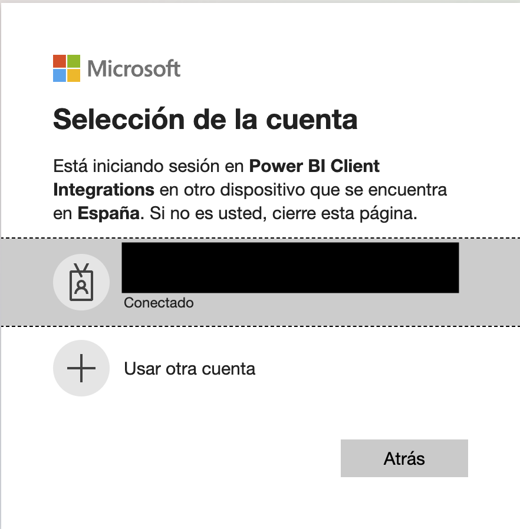
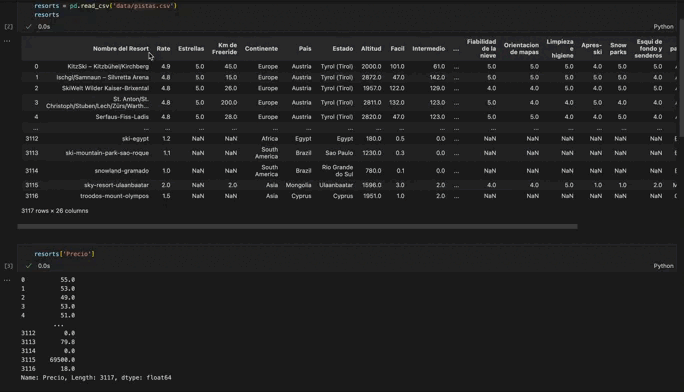
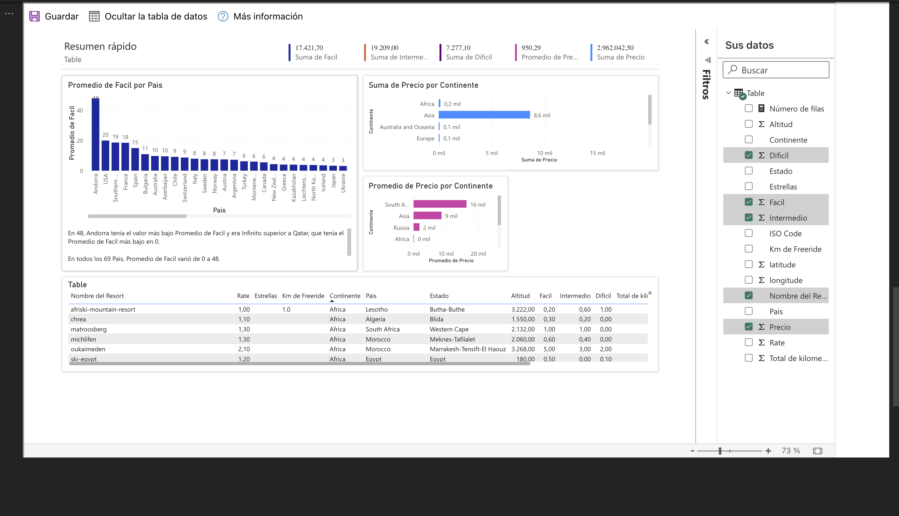

# Herramientas de Business Intelligence (BI) para la Visualización de Datos
En el mundo actual, caracterizado por rápidos cambios tecnológicos, es fundamental adquirir habilidades en diversas aplicaciones y herramientas que puedan agilizar y mejorar nuestras actividades diarias. Especialmente en industrias en constante evolución, donde cada día trae consigo nuevas formas de trabajo y oportunidades de desarrollo, es crucial saber cómo obtener y limpiar datos, así como presentarlos de manera efectiva a nuestro público objetivo. En este sentido, las herramientas de Business Intelligence (BI) desempeñan un papel clave.

En este repositorio, te presentamos un código en Python utilizando Jupyter Notebook, que te permitirá obtener rápidamente una visión general de tus datos y comenzar a obtener información valiosa, sobre la cual podrás trabajar más detenidamente.

## Cómo crear una cuenta de correo empresarial
El primer paso es crear una "cuenta de empresa" en Microsoft. Existen varios tutoriales disponibles en línea que te guiarán en este proceso de manera rápida y sencilla. Es importante que guardes tu nombre de usuario y contraseña, ya que los necesitarás en los pasos siguientes.

|      |      |      |
|------|------|------|
|  |  |  |


## Cómo crear un informe en Jupyter Notebook
Una vez que tengas una cuenta de Microsoft para empresas y seas usuario de Jupyter Notebook, podrás empezar a trabajar en tu informe. Sigue estos pasos:

Paso 1: Importar o leer el conjunto de datos

```python
from powerbiclient import QuickVisualize, get_dataset_config, Report
from powerbiclient.authentication import DeviceCodeLoginAuthentication
import pandas as pd
```
Paso 2: Autenticar tu usuario y conectar los servidores de Jupyter con Power BI


``` python
from powerbiclient import QuickVisualize, get_dataset_config, Report
from powerbiclient.authentication import DeviceCodeLoginAuthentication

import pandas as pd
```

Paso 3: Llamar al conjunto de datos y generar un panel de control con Power BI

``` pyhton
PBI_visualize = QuickVisualize(get_dataset_config(df), auth=device_auth)

# Render the new report
PBI_visualize
```


# Mostrar el nuevo informe

Con estos pasos, obtendrás un panel de control interactivo en el que podrás elegir el tipo de gráfico, los datos que deseas visualizar, la cantidad de datos y la forma de presentarlos. En resumen, esta herramienta te proporciona una visión rápida de tus datos y te ayuda a identificar áreas clave en las que puedes enfocarte.

Aprovecha las herramientas de Business Intelligence para obtener información valiosa de tus datos y tomar decisiones informadas. Con este código en Jupyter Notebook y Power BI, podrás visualizar y analizar tus datos de manera efectiva, optimizando así tu trabajo y resultados.

|      |
|------|
| 

## Contribuciones
Si deseas contribuir a este proyecto, ¡estás más que bienvenido! Puedes enviar tus sugerencias, mejoras o correcciones a través de solicitudes de extracción. Juntos, podemos hacer de este repositorio un recurso aún más valioso para la comunidad.
