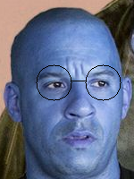
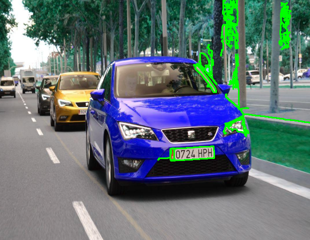
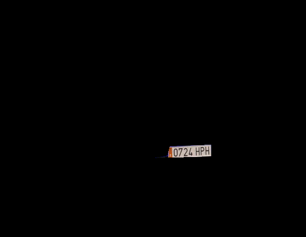
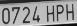
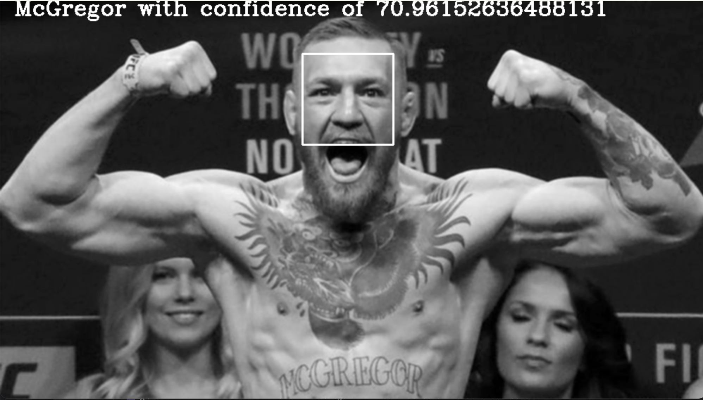

# Procesamiento de imágenes, reconocimiento de matrículas y reconocimiento facial
¡Bienvenidos al taller de OpenCV! En este taller, aprenderemos los fundamentos de procesamiento de imágenes utilizando la biblioteca OpenCV. Además, exploraremos cómo utilizar técnicas de reconocimiento de matrículas con OCR (Optical Character Recognition) y reconocimiento facial.

 # Requisitos previos
Antes de comenzar el taller, asegúrate de tener instalado lo siguiente:

- Python 3.x
- Jupyter Notebook
- OpenCV
- Tesseract OCR (para el reconocimiento de matrículas)

 # Contenido del taller
El taller consta de dos partes principales:

 # Parte 1: Procesamiento de imágenes con OpenCV 

En esta parte, exploraremos las funciones y capacidades de OpenCV para procesar imágenes. Cubriremos los siguientes temas:

1.  Lectura y visualización de imágenes
2.  Manipulación de canales de color
3.  Aplicación de filtros y mejoras de imagen
4.  Detección de bordes
5.  Segmentación de imágenes
6.  Transformaciones geométricas
7.  Aplicación de máscaras
8.  Extracción de características


 # Parte 2: Reconocimiento de matrículas y reconocimiento facial
    En esta parte, nos centraremos en técnicas avanzadas utilizando OpenCV y Tesseract OCR para reconocer matrículas y caras en imágenes. Cubriremos los siguientes temas:
|      |      |      |
|------|------|------|
|  |  |  |

1. Preprocesamiento de imágenes para el reconocimiento de matrículas
2. Detección y extracción de regiones de interés (ROI) en imágenes de matrículas
3. Aplicación de OCR para el reconocimiento de caracteres en las matrículas
4. Uso de algoritmos de reconocimiento facial para identificar caras en imágenes
5. Extracción de características faciales y comparación de rostros


# Estructura del repositorio
En este repositorio encontrarás los siguientes archivos y carpetas:

1. ``` procesamiento.ipynb```: Jupyter Notebook con el código y ejemplos para la parte 1 del taller.
2. ```plates.ipynb```: Jupyter Notebook con el código y ejemplos para la parte 2å del taller.
3. ``` static/```: Carpeta que contiene imágenes de muestra para utilizar en los ejemplos.
4. ```plates.py```: Script para generar csv con las matriculas recogidas en las fotos.
# Instrucciones de uso
1. Clona este repositorio en tu máquina local o descarga los archivos en formato ZIP.
2. Abre Jupyter Notebook en tu entorno de Python.
3. Navega hasta la ubicación del archivo ```.ipynb ``` correspondiente a la parte del taller que deseas explorar.
4. Abre el archivo ```.ipynb ```  y sigue las instrucciones y ejemplos proporcionados en el notebook.
¡Y eso es todo! Si sigues los pasos anteriores, estarás listo para comenzar a explorar el apasionante mundo del procesamiento de imágenes, el reconocimiento de matrículas y el reconocimiento facial utilizando OpenCV.

¡Disfruta del taller y diviértete explorando las posibilidades de OpenCV!

# Recursos adicionales
* Documentación de OpenCV: https://docs.opencv.org
* Documentación de Tesseract OCR: [https://github.com/tesseract-ocr/tesseract/wiki](https://